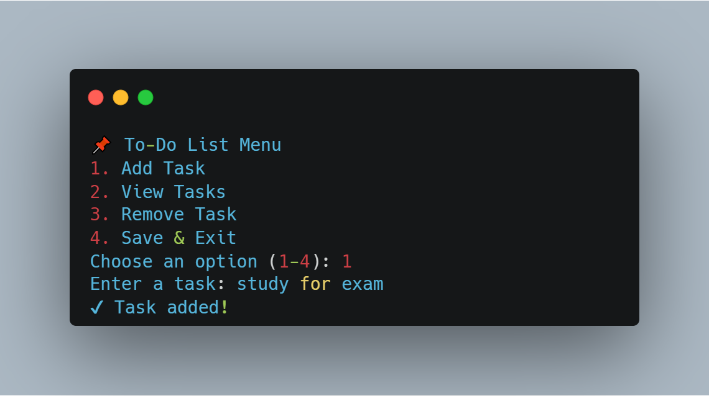
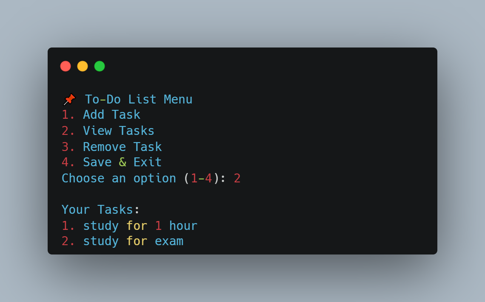
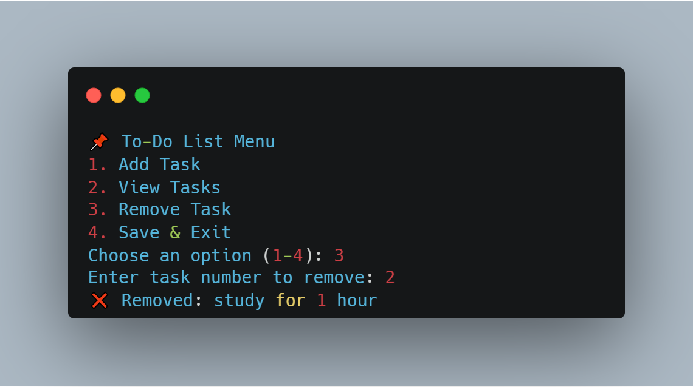

# 📝 To Do List app in Python

A simple **command-line To-Do List application** written in Python.  
This is a beginner-friendly project that I built to practice **loops, lists, file handling, and user input**.

---

## 🚀 Features
- Add new tasks ✅  
- View all tasks 👀  
- Remove tasks ❌  
- Save tasks to a file (`tasks.txt`) 💾  
- Load tasks from a file 📂  

---

## 📂 Project Structure
todo-list-python/
├── to_do_list.py # Main Python program
├── tasks.txt # File where tasks are saved (auto-created if missing)
└── README.md # Project documentation


---

## ⚡ How to Run
1. Make sure you have **Python 3** installed on your computer.  
2. Download or clone this repository.  
3. Open a terminal/command prompt inside the project folder.  
4. Run the program:
   ```bash
   python todo-list.py

---

🧠 What I Learned

How to work with lists and loops in Python.

Handling user input and validation.

Reading from and writing to text files.

Building a simple menu system for the terminal.

---

📌 Future Improvements

Mark tasks as completed ✅/❌

Add due dates for tasks 📅

GUI version using Tkinter 🖥️

Export tasks to JSON or CSV

---

## 🖼️ Screenshots

Here are some screenshots of the project in action:

### 📌 Main Menu


### ➕ Adding Tasks


### 📋 Viewing Tasks


### ❌ Removing a Task


---

